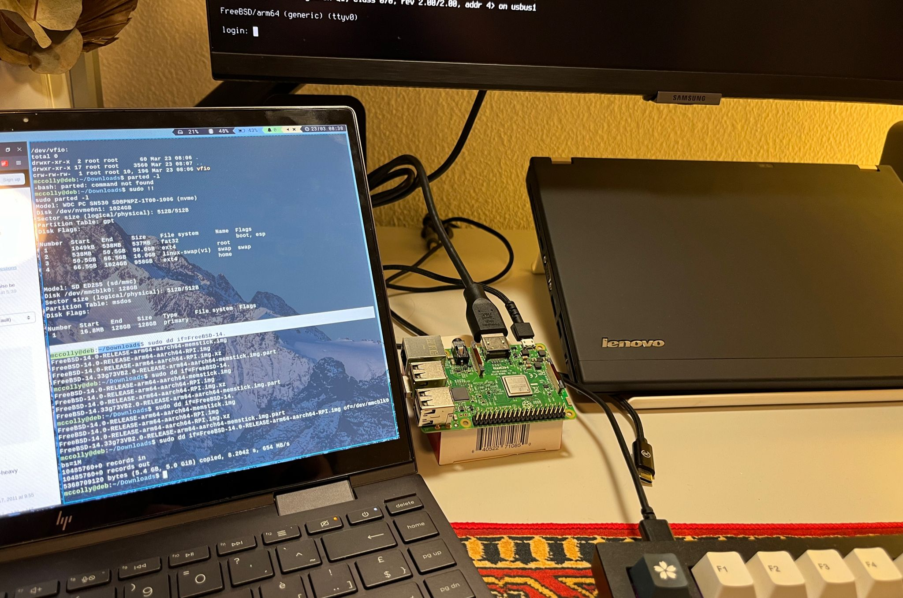
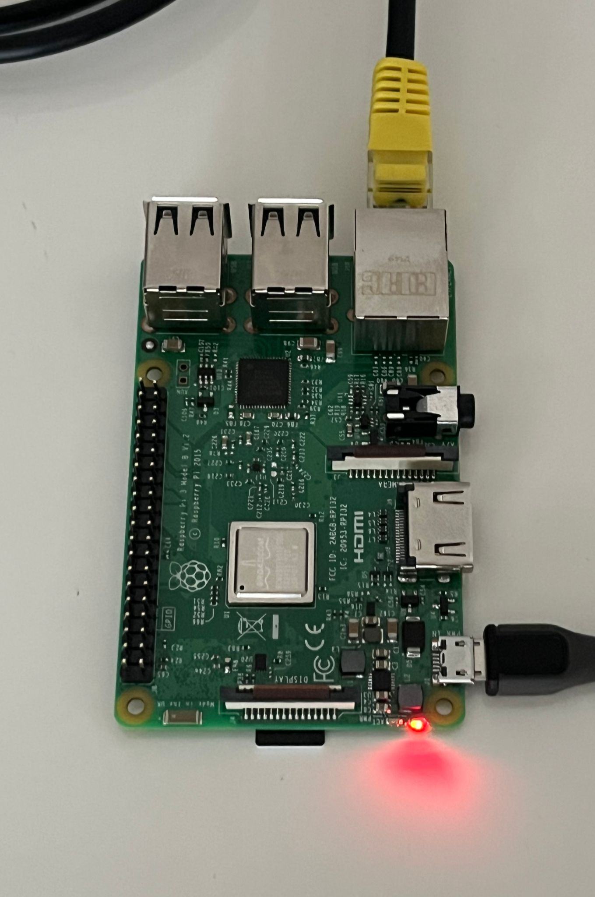
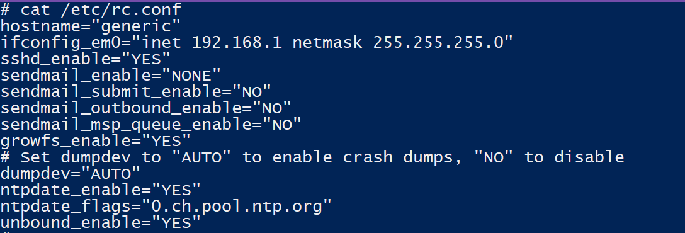
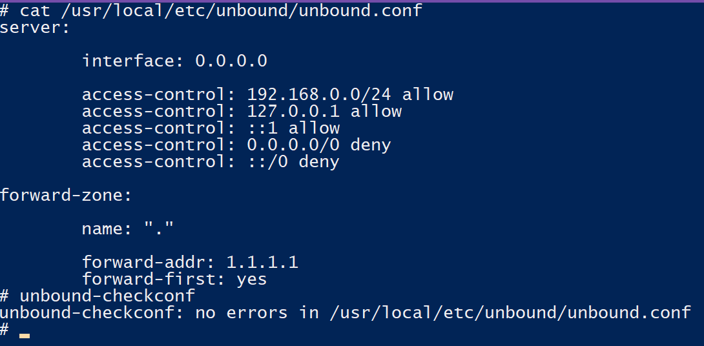
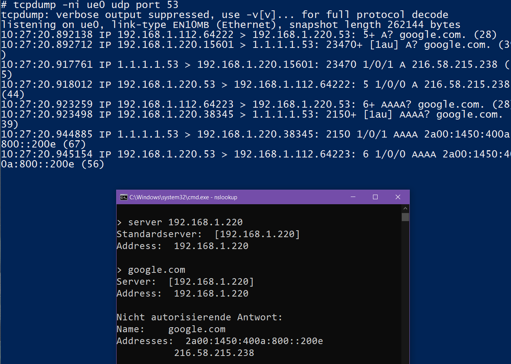

# FreeBSD als DNS/DHCP

Ich plane, mit einem Raspberry Pi einen DNS/DHCP-Server einzurichten, der als netzwerkweiter AdBlocker fungiert. Mein Ziel ist es, PiHole vollständig durch eine massgeschneiderte Lösung unter FreeBSD zu ersetzen, inklusive Benutzeroberfläche und Protokollen. Durch dieses Projekt hoffe ich, meine Kenntnisse in der Arbeit mit Servern und insbesondere mit FreeBSD zu vertiefen. Obwohl PiHole eine grossartige “Out of the Box” Lösung ist, glaube ich, dass ich viel mehr lernen werde, wenn ich DNS und DHCP manuell installiere und konfiguriere.

Als Vorbereitung auf dieses Projekt, habe ich mich ausführlich mit den Unterschieden und Vorteilen von FreeBSD gegenüber Linux befasst. 
Einfachkeitshalber enthalte ich mich von trivialen Erklärungen in Installationsprozessen und fixiere mich eher auf die Probleme und Erfolge, welche ich in diesem Projekt erlebt habe.

Todo

- [x]  Setup FreeBSD (headless)
- [x]  Install Unbound
- [x]  Unbound config + Testing
- [x]  StevenBlack Hostlist einfügen aktivieren
- [x]  Testing “AdBlocker”
- [x]  DHCP-Server Install + Config
- [x]  DHCP-Server Testing

- [x]  DHCP + Unbound Test
- [ ]  Firewall einrichten
- [ ]  Recursive DNS-Server konfigurieren
- [ ]  User Interface installieren (InfluxDB2?)
- [ ]  (DNS over TLS?)

```css
Wichtige Commands:
unbound-checkconf // Config file auf Fehler prüfen
service start unbound // unbound starten (startet auch beim aufstarten vie rc.conf)
service unbound restart // service neustarten
/usr/local/sbin/dhcpd -t -cf /usr/local/etc/dhcpd.conf //check for syntax errors

(pkg install ca_root_nss // root certificate installieren für recursive)
```

### Configs

### rc.conf

```css
hostname="freeBSD-DNS"
ifconfig_ue0="inet 192.168.1.220 netmask 255.255.255.0"
sshd_enable="YES"
sendmail_enable="NONE"
sendmail_submit_enable="NO"
sendmail_outbound_enable="NO"
sendmail_msp_queue_enable="NO"
growfs_enable="YES"
# Set dumpdev to "AUTO" to enable crash dumps, "NO" to disable
dumpdev="AUTO"
syslogd_flags="-ss"
ntpdate_enable="YES"
ntpdate_flags="0.ch.pool.ntp.org"
unbound_enable="YES"
dhcpd_enable="YES"
dhcpd_ifaces="ue0" 
```

### unbound.conf

```css
server:
	interface: 0.0.0.0
	access-control: 192.168.1.0/24 allow
	access-control: 127.0.0.1 allow
	access-control: ::1 allow
	access-control: 0.0.0.0/0 deny
	access-control: ::/0 deny
	
forward-zone:
	name: "."
	forward-addr: 1.1.1.1
	forward-first: yes

#include "usr/local/etc/unbound/blacklist.conf"
```

### dhcpd.conf

```css
subnet 192.168.1.0 netmask 255.255.255.0 {
	range 192.168.1.10 192.168.1.180;
	option routers 192.168.1.1;
	option broadcast-address 192.168.1.255;
	option domain-name-servers 192.168.1.220;
	default-lease-time 600;
	max-lease-time 7200;
}

host router {
	hardware ethernet C4:EB:39:ex:__:14;
	fixed-address 192.168.1.1;
}
	
host raspberrypi {
	hardware ethernet b8:27:ex:__:00:55;
	fixed-address 192.168.1.195;
}   
```

## 1. Setup FreeBSD (headless)

FreeBSD 14.0 .img heruntergeladen und entpackt.

Hatte Probleme microSD mit “sudo dd if=”” of=” zu überschreiben. 
Vermutung: microSD Karte mit 128GB zu gross wegen FAT formatierung.
Konnte mit Raspi Image Builder gelöst werden.

Nach erfolgreichen Booten nächstes Problem: Tastatur funktioniert nicht, kein Login ins System möglich. SD Karte neu geflasht, auch mit älterer Version (13.2), Problem immernoch vorhanden.
Vermutung: Treiberfehler. Da ich keine zweite Tastatur zur Verfügung habe, habe ich mich entschieden dazu entschieden es Headless via SSH aufzusetzen.



Image Flash via Terminal



Headless Setup

## 2. Setup Unbound

Installieren/konfigurieren von unbound und Voreinstellungen.

```css
pkg install unbound
cp /usr/local/etc/unbound/unbound.conf /usr/local/etc/unbound/unbound.conf.backup
cp /etc/rc.conf /etc/rc.conf.backup 
```





Nach Reboot keine Connection mehr. Beim Kontrollieren merkt man sofort: IP falsch konfiguriert + falsches Interface. Da ich keine Möglichkeit habe direkt auf den Raspi zuzugreiffen(Tastatur) entscheide ich mich kurzerhand dafür FreeBSD neu zu installieren bzw das Image neu zu flashen. 
Gleich eine gute Übung. **You fail, you grow.**

Nachdem alles wieder neu aufgesetzt ist gleich testen: Test erfolgreich!



## 2.1 “AbBlocker” aufsetzen

Der “AdBlocker” funktioniert so, dass er DNS Anfragen für gewisse Seiten ins Leere schickt, somit werden die Inhalte für Werbungen nie geladen.

Ich benutze die Host List von StevenBlack ([https://github.com/StevenBlack/hosts](https://github.com/StevenBlack/hosts))

Um die Host-Liste in ein “Unbound-konformes” Layout zu bringen, rufe ich dieses Script auf.

```css
vim hostlist.sh
---------------------------------------------------------------------------------
#!/bin/sh

echo "server:" >/etc/unbound/blacklist.conf
curl -s https://raw.githubusercontent.com/StevenBlack/hosts/master/hosts | \
        grep ^0.0.0.0 - | \
        sed 's/ #.*$//;
        s/^0.0.0.0 \(.*\)/local-zone: "\1" refuse/' \
        >>/etc/unbound/blacklist.conf
---------------------------------------------------------------------------------           
```

Nachdem ich das File gespeichert und ausgeführt hatte:

```css
chmod +x hostlist.sh
./hostlist.sh   

cat hostlist.sh
server:
```

Fehlersuche:

- Ist curl, grep und sed isntalliert? Ja
- funktioniert curl? Nein

Neue quelle probiert: Problem gelöst

```css
#!/bin/sh

echo "server:" >/etc/unbound/blacklist.conf
curl -s sbc.io/hosts/hosts | \
        grep ^0.0.0.0 - | \
        sed 's/ #.*$//;
        s/^0.0.0.0 \(.*\)/local-zone: "\1" refuse/' \
        >>/etc/unbound/blacklist.conf
```

Jetzt muss ich das File nur noch in der unbound.conf Datei integrieren:

```css
#include "usr/local/etc/unbound/blacklist.conf"
```

## 3. FreeBSD DHCP

Um sicherzustellen, dass jedes neu verbundene Gerät im Netzwerk den neu eingerichteten Unbound DNS-Server verwendet, muss ich einen DHCP-Server einrichten, der diese Information bereitstellt.

```css
isc-dhcp44-server install
cp /usr/local/etc/dhcpd.conf /usr/local/etc/dhcpd.conf.backup
rm /usr/local/etc/dhcpd.conf
vim /usr/local/etc/dhcpd.conf
```

Beim Konfigurieren muss ich darauf achten, dass ich meinem Router und meinem zweiten Raspi eine statische IP zuweise.(MAC-Adressen bewusst verfälscht)

### dhcpd.conf

```css
subnet 192.168.1.0 netmask 255.255.255.0 {
	range 192.168.1.10 192.168.1.180;
	option routers 192.168.1.1;
	option broadcast-address 192.168.1.255;
	option domain-name-servers 192.168.1.220;
	default-lease-time 600;
	max-lease-time 7200;
}

host router {
	hardware ethernet C4:EB:39:ex:__:14;
	fixed-address 192.168.1.1;
}
	
host raspberrypi {
	hardware ethernet b8:27:ex:__:00:55;
	fixed-address 192.168.1.195;
}   
```

Bevor ich den Service starte noch kurz ein Syntax-Check des config files:

```css
/usr/local/sbin/dhcpd -t -cf /usr/local/etc/dhcpd.conf
```

Damit der Service immer bei Serverstart läuft noch die *rc.conf* bearbeiten und den Service manuell starten:

```css
---------------------
...
dhcpd_enable="YES"
dhcpd_ifaces="dc0"
---------------------

service-ist-dhcpd start
```

Terminal output Test-Device: Erfolgreich!

```haskell
mccolly@deb:~$ sudo dhclient -r
[sudo] password for mccolly: 
Killed old client process
mccolly@deb:~$ sudo dhclient
mccolly@deb:~$ ip a
1: lo: <LOOPBACK,UP,LOWER_UP> mtu 65536 qdisc noqueue state UNKNOWN group default qlen 1000
    link/loopback 00:00:00:00:00:00 brd 00:00:00:00:00:00
    inet 127.0.0.1/8 scope host lo
       valid_lft forever preferred_lft forever
    inet6 ::1/128 scope host noprefixroute 
       valid_lft forever preferred_lft forever
2: wlo1: <BROADCAST,MULTICAST,UP,LOWER_UP> mtu 1500 qdisc noqueue state UP group default qlen 1000
    link/ether a8:93:4a:xxxxxx brd ff:ff:ff:ff:ff:ff
    altname wlp1s0
    inet 192.168.1.11/24 brd 192.168.1.255 scope global dynamic wlo1
       valid_lft 595sec preferred_lft 595sec
    inet6 fe80::xx93:4aff:fe03:2c1d/64 scope link noprefixroute 
       valid_lft forever preferred_lft forever
mccolly@deb:~$ nslookup google.com
Server:		192.168.1.220
Address:	192.168.1.220#53

Non-authoritative answer:
Name:	google.com
Address: 142.250.203.110
Name:	google.com
Address: 2a00:1450:400a:808::200e

mccolly@deb:~$ nslookup adclick.com 
Server:		192.168.1.220
Address:	192.168.1.220#53

Non-authoritative answer:
*** Can't find zqtk.net: No answer

```

### Quellen:

[Chapter 32. Network Servers](https://docs.freebsd.org/en/books/handbook/network-servers/)

[FreeBSD Unbound DNS Server Setup](https://www.youtube.com/watch?v=1OkpvQsdm24)

[Using Unbound as an Ad-blocker - Alpine Linux](https://wiki.alpinelinux.org/wiki/Using_Unbound_as_an_Ad-blocker)

[Links](FreeBSD%20als%20DNS%20DHCP%20f7a00dd7170041c4b7cbcc87167932c6/Links%20f074bede0a7b461f85f898220d5df19a.md)