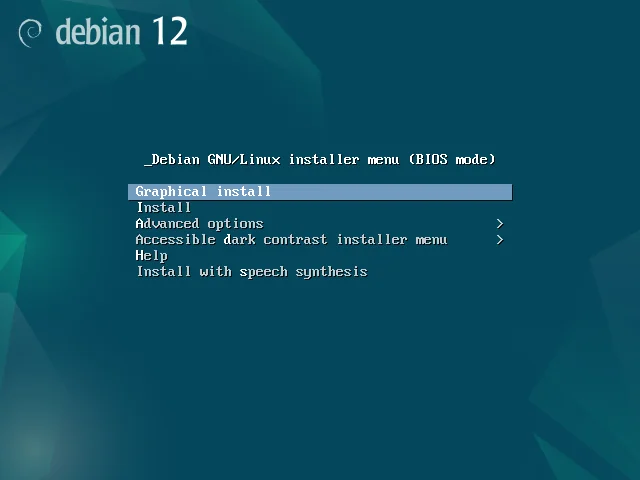
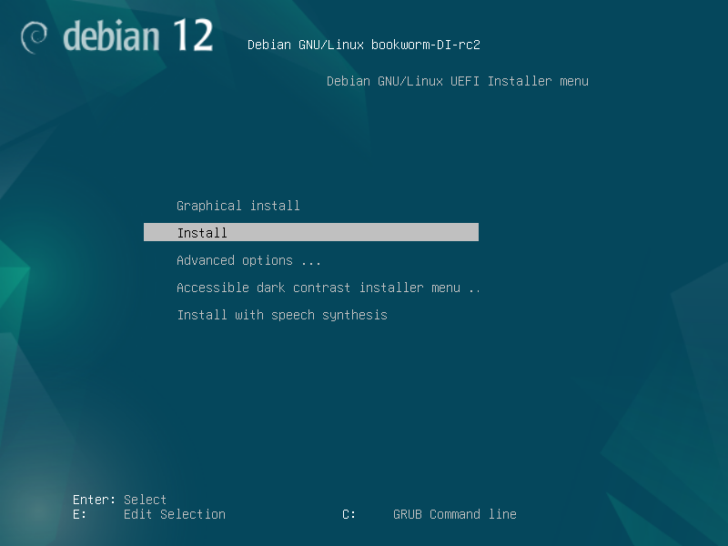
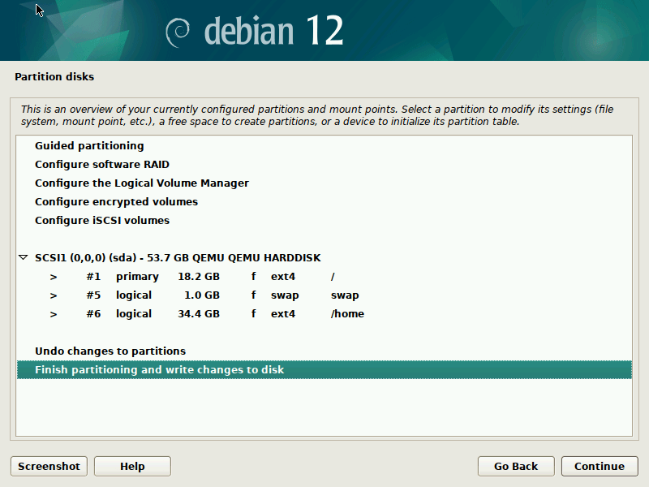
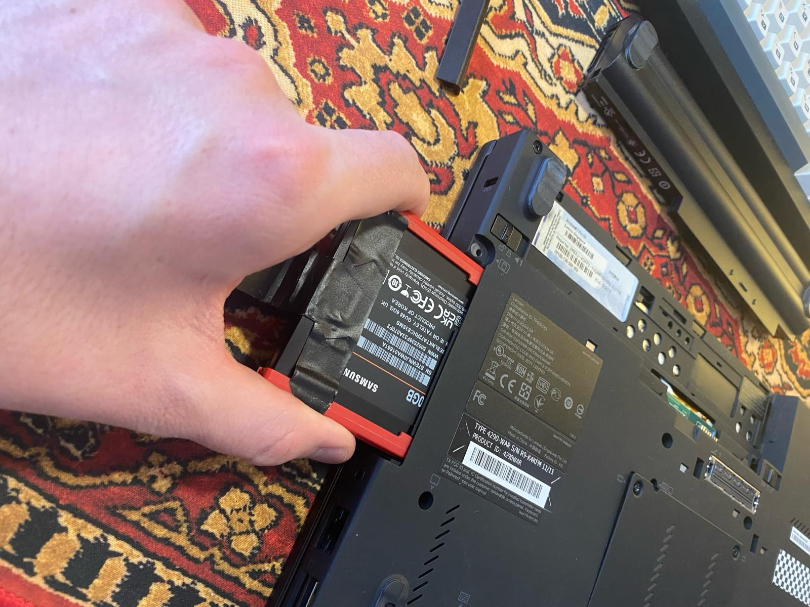
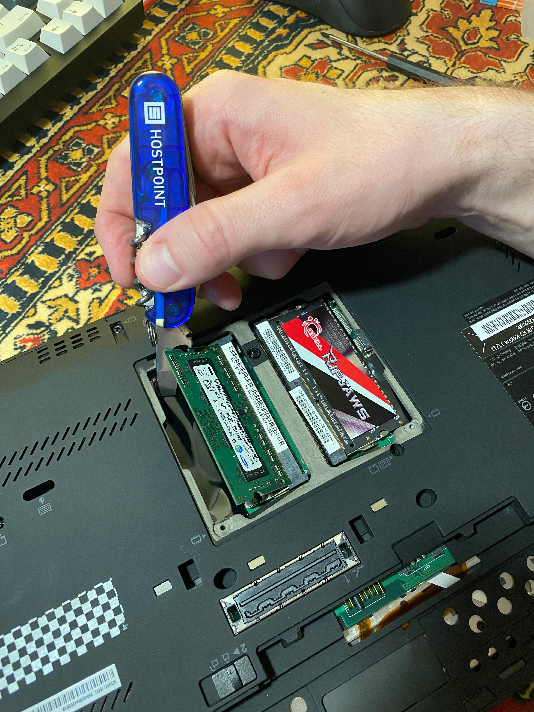

# ThinkPad x220

Ein kleines Projekt, das ich schon seit einiger Zeit im Auge habe, ist das ThinkPad X220. Ich bin fasziniert von seinem Vintage-Design und habe beschlossen, es als meinen täglichen Begleiter zu nutzen. Nebenbei möchte ich diese Gelegenheit nutzen, um mich intensiver mit der Hardware auseinanderzusetzen und mein Wissen über ROM-Flashes sowie BIOS/UEFI-Systeme zu vertiefen.

Mal sehen, wohin mich die Reise der Hardware- und Software-Modifikation führen wird. Ich bin gespannt darauf, welche Entdeckungen ich auf dem Weg machen werde und welche neuen Fähigkeiten ich durch diese Erfahrung erwerben werde. Es fühlt sich an wie ein aufregendes Abenteuer, bei dem ich mein ThinkPad X220 weiterentwickeln und gleichzeitig mein Verständnis für Technologie vertiefen kann.

Ein grosses Dankeschön an die Website [https://x220.mcdonnelltech.com/resources/](https://x220.mcdonnelltech.com/resources/) für die Bereitstellung einer so umfassenden Übersicht zu allem Wissenswerten über das X220. Diese Ressource hat mir viel Zeit erspart, die ich sonst mit Suchen im Internet verbracht hätte.

.jpeg)

.jpeg)

Todo

- [x]  Linux install
- [x]  Hardware-Upgrade
- [x]  Coreboot durch ROM Flash installieren (Dokumentation muss noch aktualisiert werden)
- [ ]  HD-Display Upgrade

## 1. Linux install

First things first - lets remove Windows and install Linux! :D 

Beim aufbooten sah es schon etwas anders aus als sonst, aber ich habe es einfach auf den “alten” Laptop geschoben. Das hat sich noch als Fehler entpuppt.



Debian 12 Installer BIOS mode



Debian 12 Installer UEFI mode

Beim Weitermachen mit der Installation und beim Partitionieren der SSD fiel mir etwas auf, was ich noch nicht kannte: Die Unterscheidung zwischen primären und logischen Partitionen. Nach einer kurzen Recherche fand ich heraus, dass dies auf das MBR-Partitionsschema zurückgeht, eine Methode, die vor der Entwicklung des GPT-Partitionierungsstandards genutzt wurde. 
Das war ein interessanter Lernmoment für mich.

Daraufhin entschied ich, die Installation abzubrechen und einen Blick ins BIOS zu werfen. Dort stellte ich fest, dass der UEFI/Legacy-Modus auf “Both” und "Legacy first" eingestellt war, was erklärt, warum der Installer im BIOS-Modus lief. Nachdem ich die Einstellungen im BIOS angepasst hatte, um UEFI zu priorisieren, startete ich die Installation erneut.



Partition mit MBR-Schema


Partition mit GPT-Schema

Installer startet diesmal im UEFI-Mode, ich fahre fort wie gewohnt und lande bei der Partitionierung, dieses mal sieht alles wie gewohnt aus.

Partitionen erstellt und weiter… Wieder Fehlermeldung.

```css
syslog installation

Mar  8 21:32:21 main-menu[480]: (process:7494): mount: mounting none on /sys/firmware/efi/efivars failed: Device or resource busy
Mar  8 21:32:21 main-menu[480]: (process:7494):   Error reading device /dev/sda at 0 length 512.
Mar  8 21:32:21 main-menu[480]: (process:7494):   
Mar  8 21:32:21 main-menu[480]: (process:7494): Error reading device /dev/sda at 0 length 4096.
Mar  8 21:32:21 main-menu[480]: (process:7494): mount: mounting none on /sys/firmware/efi/efivars failed: Device or resource busy
Mar  8 21:32:21 main-menu[480]: (process:7494): mount: mounting none on /sys/firmware/efi/efivars failed: Device or resource busy
Mar  8 21:32:21 main-menu[480]: (process:7494):   Error reading device /dev/sda at 0 length 512.
Mar  8 21:32:21 main-menu[480]: (process:7494):   Error reading device /dev/sda at 0 length 4096.
Mar  8 21:32:21 main-menu[480]: (process:7494):   Error reading device /dev/sda at 0 length 512.
Mar  8 21:32:21 main-menu[480]: (process:7494):   Error reading device /dev/sda at 0 length 4096.
Mar  8 21:32:21 main-menu[480]: (process:7494): mount: mounting none on /sys/firmware/efi/efivars failed: Device or resource busy
```

Ich vermutete, dass die Ursache möglicherweise in einer vorherigen BIOS-Installation von Windows lag, während der Debian-Installer eine Installation via UEFI bevorzugte.

Um dieses Dilemma zu lösen, nutzte ich einen separaten USB-Stick mit Gparted, um die Festplatte vollständig zu formatieren. Trotz des vollständigen Formatierens bestanden die Probleme weiterhin, was darauf hindeutete, dass die SSD möglicherweise durch Reste der alten Windows-Installation beschädigt war.

Durch weitere Recherchen entdeckte ich, dass SSDs in einen Wiederherstellungsmodus wechseln können, wenn sie etwa 30 Minuten lang mit Strom versorgt werden, ohne Daten zu übertragen. Um dies zu erreichen, verband ich die SSD lediglich mit dem Stromkabel und liess sie für einige Zeit unberührt. Anschliessend formatierte ich sie erneut, diesmal mit dem GPT-Schema.

Nach dieser Prozedur verlief die Installation erfolgreich.

### Bootprobleme

Nach einer schnellen Erstkonfiguration des Laptops führte ich einen Neustart durch, aber merkwürdigerweise bootete das Gerät danach nicht mehr ordnungsgemäss. Obwohl Debian im Boot-Menü als Option angezeigt wurde, geschah nichts, wenn ich es auswählte. Ich vermutete, dass es ein Problem mit dem GRUB-Bootloader geben könnte, da er nicht zu starten schien. Interessanterweise startete das System jedoch korrekt, als ich einen Live-Boot-USB-Stick verwendete, um Zugang zu erhalten. Diese Situation war für mich ziemlich rätselhaft, also wiederholte ich den Vorgang mehrmals. Letztendlich konnte ich das Problem durch einige Anpassungen im BIOS beheben.

## 2. Hardware Upgrade

Angesichts des Alters des Laptops und der gestiegenen Anforderungen der heutigen Zeit entschied ich mich, ihm ein Hardware-Upgrade zu spendieren. Ich wählte eine [500 GB Samsung 870EVO SSD](https://www.digitec.ch/de/s1/product/samsung-870-evo-500-gb-25-ssd-14597794?supplier=406802) und zwei [8-GB-RAM-Module mit 1866 MHz von G.Skill](https://www.digitec.ch/de/s1/product/gskill-ripjaws-2-x-8gb-1866-mhz-ddr3-ram-so-dimm-ram-15685275?supplier=406802) aus.

Die Installation verläuft erstaunlich unkompliziert.



SSD Replacement



RAM-Replace (Easter Egg)

## 3. BIOS/UEFI-Firmware durch Coreboot ersetzen

Um die volle Leistung der RAM-Sticks mit 1866 MHz ausnutzen zu können, ist eine Modifikation des BIOS erforderlich. Obwohl es im Internet vorkonfigurierte, modifizierte BIOS-Versionen gibt, bevorzuge ich einen vorsichtigeren Ansatz. Daher entscheide ich mich für die Installation von Coreboot, einer Open-Source-Firmware, die eine flexible und sichere Alternative zum herkömmlichen BIOS oder UEFI bietet. Coreboot ermöglicht es, den Bootprozess zu beschleunigen und die Kontrolle über die Hardware zu erhöhen, indem unnötige Funktionen entfernt und die Sicherheit verbessert werden, was auch das Risiko von Backdoors minimiert.

Die Aussicht, eine eigene BIOS-Firmware zu verwenden, begeistert mich sehr, da es das Gerät noch persönlicher und vollständig unter meiner Kontrolle macht. Ausserdem finde ich erhoffe ich mir noch viel mehr über die Hardware von Computern und wie sie funktionieren zu lernen.

Bei meinen Recherchen stelle ich jedoch fest, dass mir die notwendige Hardware zur Installation von Coreboot fehlt. Ohne zu zögern, bestelle ich die erforderlichen Komponenten online und nutze die Wartezeit, um mein Wissen über Coreboot und dessen Implementierung zu vertiefen.


**TZT CH341A 24 25 Serie EEPROM-Flash-BIOS-USB Programmierer Modul**

Warten und Tee trinken. 

[Links](ThinkPad%20x220%2089781bc9a52c40d89aca82e9ad9cdb76/Links%2070885424f5e340b3b4a5afad82c90e4a.md)